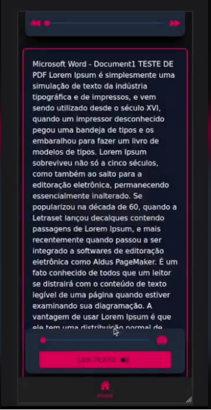

Text to Speech - Transformando PDF em Áudio! 📚🔊

Bem-vindo ao meu mais recente projeto: um aplicativo incrível que utiliza a tecnologia Ionic para transformar PDF em áudio! 🚀 Agora, você pode simplesmente inserir seu PDF no app e testemunhar a magia acontecer! ✨
Funcionalidades

    Conversão Rápida: Insira seu PDF e experimente a leitura em voz alta em tempo real.
    Salvamento Simples: Utilize a rota em Python para salvar o PDF facilmente.
    Design Moderno: Desfrute de uma interface amigável e responsiva, aprimorada com o uso do Tailwind.

Como Funciona

    Inserção do PDF: Carregue seu arquivo PDF no aplicativo.
    Conversão Instantânea: Assista ao texto do PDF sendo convertido em áudio em tempo real.
    Salvamento Opcional: Utilize a rota Python para salvar o PDF, se desejar.

Tecnologias Utilizadas

    Ionic: Desenvolvimento do aplicativo para uma experiência móvel suave.
    Python: Implementação de rotas para salvar e enviar conteúdo extraído do PDF.
    Tailwind CSS: Garantindo um design moderno, responsivo e amigável.

Benefícios

Este projeto visa facilitar a acessibilidade e tornar a leitura mais dinâmica, proporcionando uma experiência de usuário aprimorada. Estou entusiasmado em compartilhar esta inovação e espero que aproveite! 🚀🔊
Agradecimentos

[Clique aqui para ver o video](https://www.linkedin.com/posts/igor-gabriel-martins-ramos_texttospeech-desenvolvimentodeapp-acessibilidade-activity-7163992880561250305-4QMJ?utm_source=share&utm_medium=member_desktop)

Obrigado por explorar o Text to Speech - Transformando PDF em Áudio! Sinta-se à vontade para contribuir e melhorar este projeto. 👏

Divirta-se explorando! 🎉